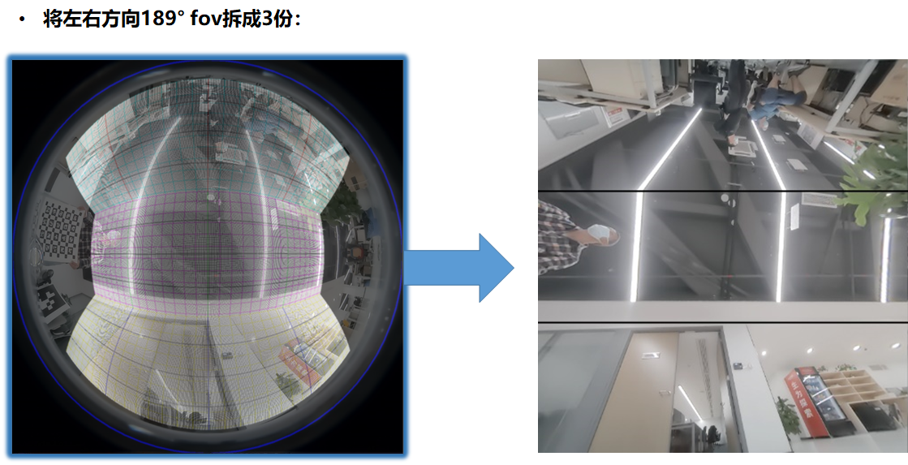
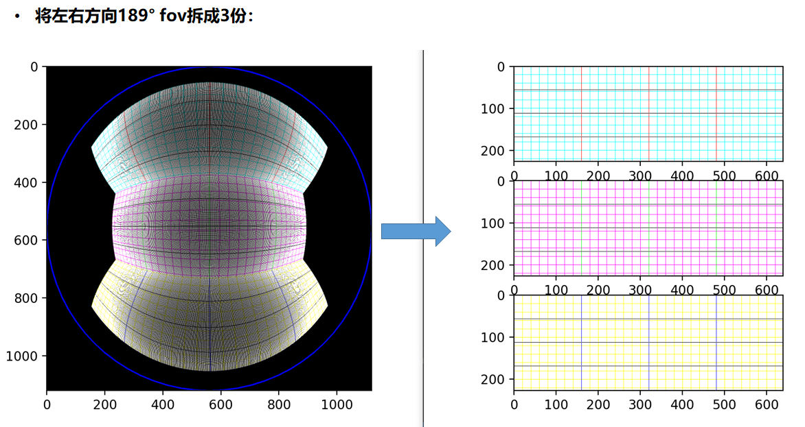
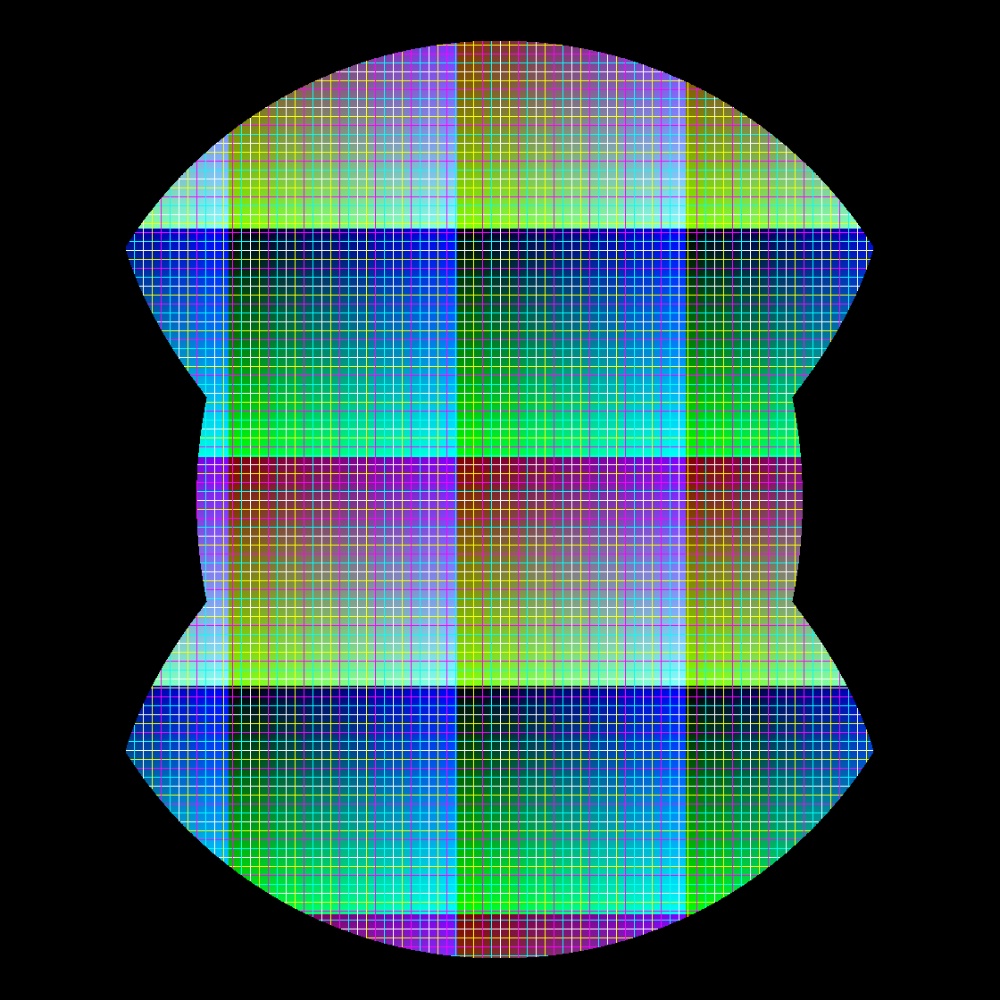
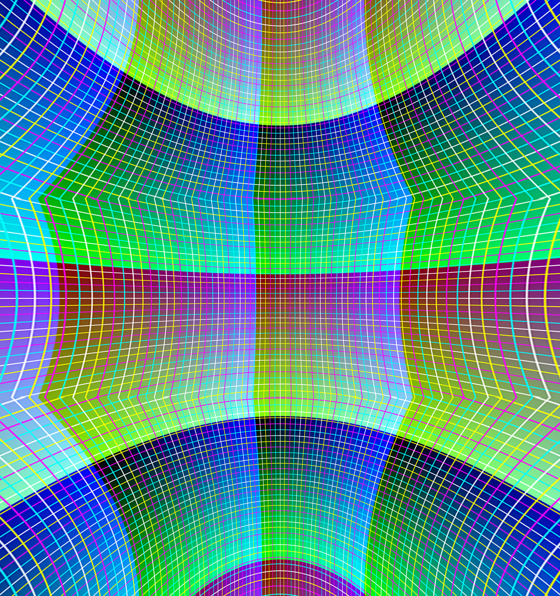
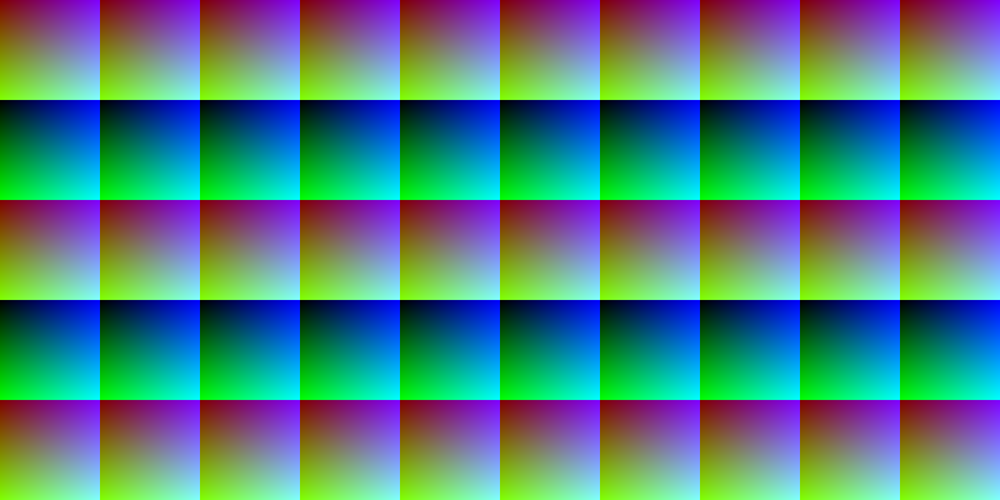
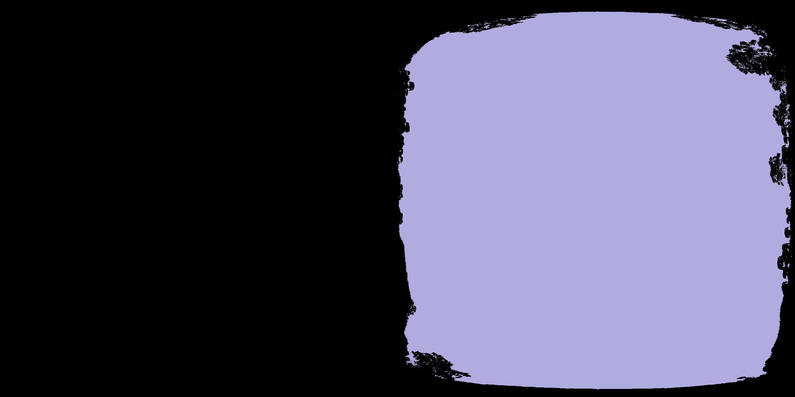
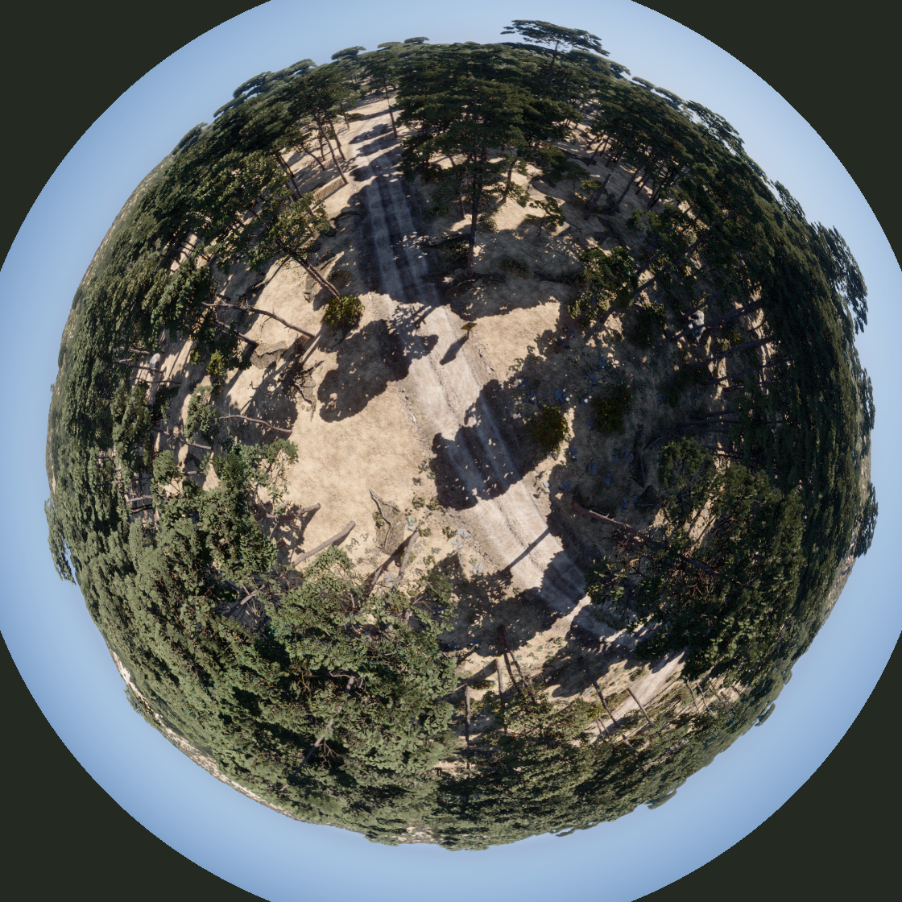
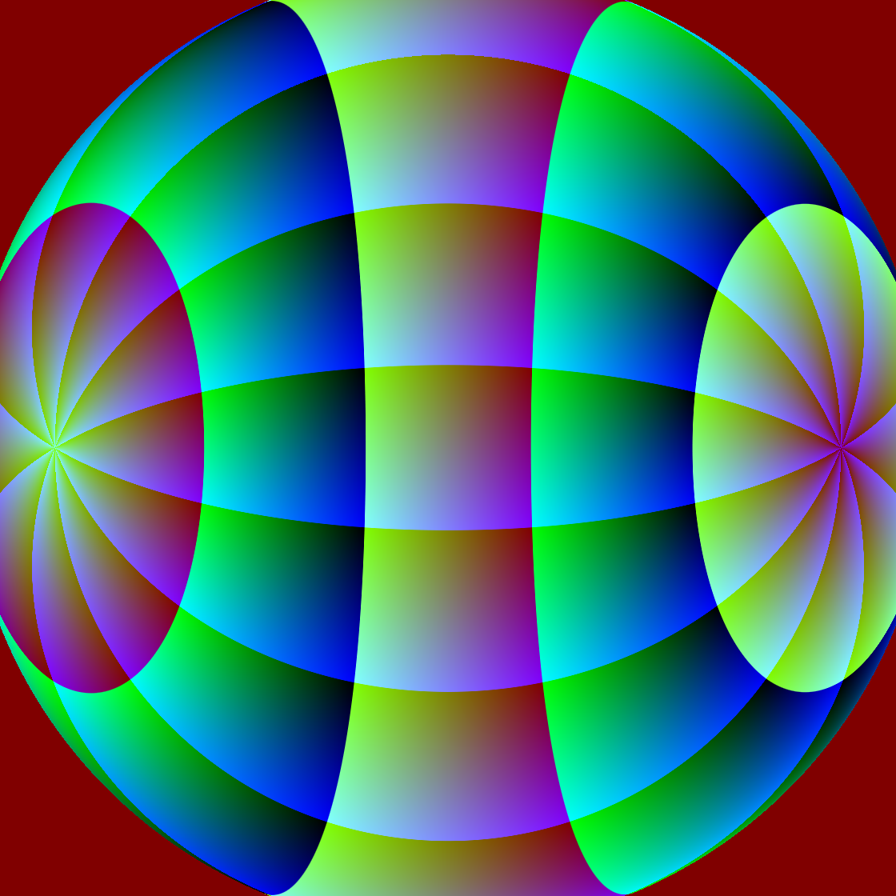
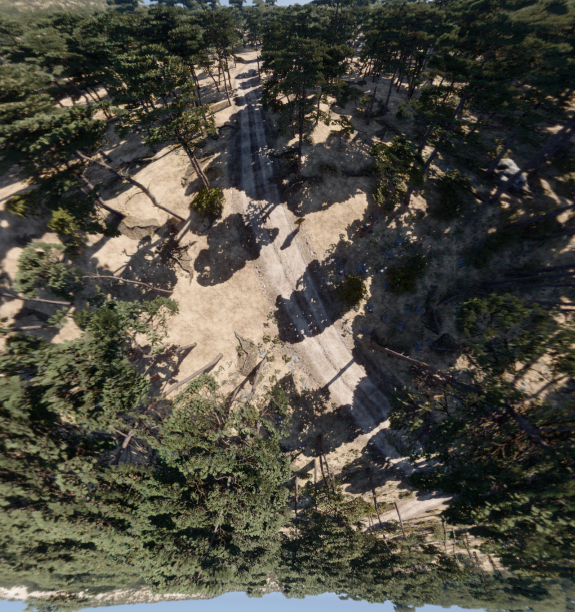
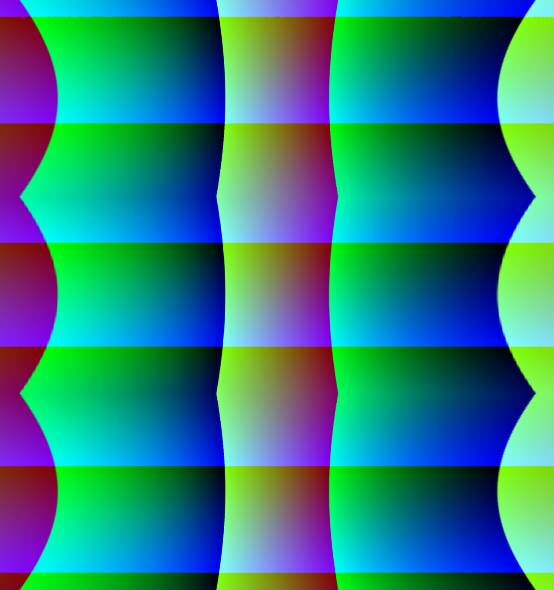

# Procedures to add noises to fisheye images

## Overview
Since the noises are applied to the fisheye images in the real-world, we project our output to the round fisheye images to add noises. Specifically, we have the following procedures. 
1. Project the panorama image to the round fisheye images.
2. Secondly, we add noises on the fisheye images. 
3. Finally, we apply the same 1-fisheye-to-3-pinholes remapping function to the fisheye image to generate the final image, which makes the noises closer to the real-world image noises.

Kudos to Dr. Zhenpeng Bian, the 1-fisheye-to-3-pinholes remapping is illustrated in the image below.

## Simulator output

Simulator outputs panorama images like below.
Kudos to Dr. Zhenpeng Bian for the regularly divided benchmark image below.

* Panorama scene image

<!-- * Panorama depth image

* Panorama segmentation image
 -->

## Converts a panorama image to two fisheye image.

* Fisheye scene images

<!-- * Fisheye depth images

 -->

<!-- * Fisheye segmentation images

 -->

<!-- ## Adds noises on the fisheye image

* Fisheye scene noisy image

 -->

## Converts/rectifies one noisy fisheye image to 3 pinhole images.

* Rectified original image

<!-- * Rectified noisy image

 -->

<!-- 
* Rectified depth down image

* Rectified segmentation up image

 -->
